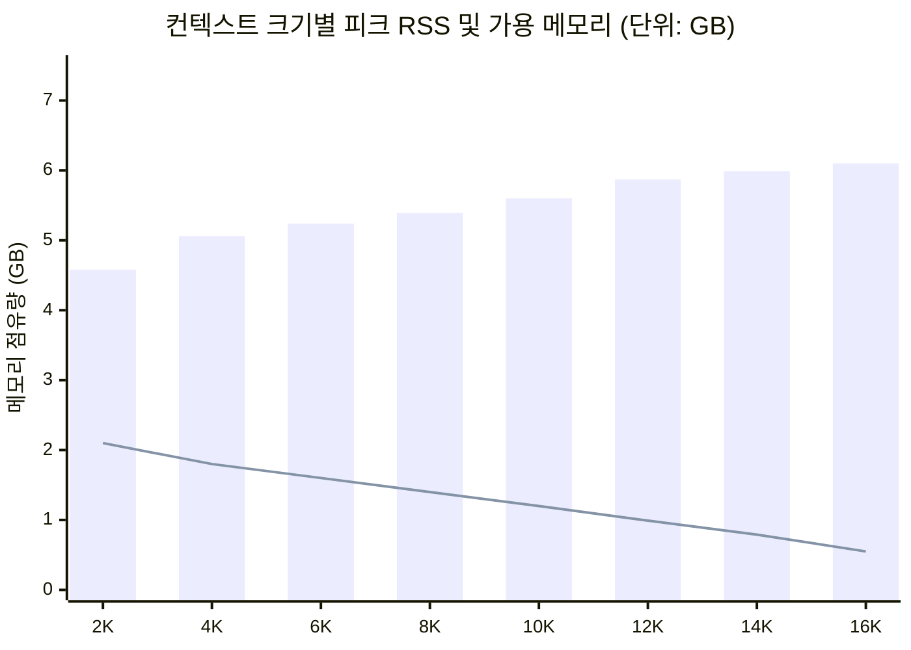

# Gemma 4 E4B 컨텍스트 메모리 벤치마크 및 최적 설정 보고서

## 1. 벤치마크 개요 및 테스트 환경

본 보고서는 NVIDIA Jetson Orin 환경에서 LiteRT-LM 기반 멀티모달 CLI 서버 구동 시, `gemma-4-E4B-it.litertlm` 모델의 컨텍스트 토큰 크기(`--max-tokens`) 변화에 따른 메모리 점유량과 시스템 가용 메모리 마진을 실측한 결과를 정리한 문서입니다.

### 💻 하드웨어 및 시스템 스펙
- **대상 장치**: NVIDIA Jetson Orin (기본 아키텍처: `aarch64`, Cortex-A78AE 6-core)
- **통합 메모리 (Unified RAM)**: 총 7.4 GiB (CPU 및 GPU 공유)
- **스왑 메모리 (Swap Space)**: 총 3.7 GiB (3894 MiB)
- **운영체제 커널**: Linux 5.15.199-tegra (JetPack 기반)
- **기본 대기 메모리 점유 (OS & 백그라운드)**: 약 0.8 ~ 1.0 GiB
- **가속 백엔드**: GPU 가속 (`--gpu`, WebGPU / Vulkan 백엔드, Ampere 아키텍처)
- **테스트 모델**: `gemma-4-E4B-it.litertlm` (가중치 파일 크기: 약 3.40 GiB)

---

## 2. LiteRT-LM 컨텍스트 메모리 할당 동작 구조

LiteRT-LM 엔진은 실행 시 동적 할당으로 인한 지연 및 단편화를 방지하기 위해 정적 텐서 재구성(Static Shape Resizing)을 수행합니다:

1. **매직 넘버 텐서 재구성**: 모델 파일 내 기본 컨텍스트 정의(`magic_number=32003`)를 CLI 파라미터(`target_number=<max_tokens>`)로 수정하여 텐서 크기를 결정합니다.
   - `decode` 서명: 577개 텐서 크기 업데이트
   - `prefill_1024` 서명: 426개 텐서 크기 업데이트
   - `prefill_128` 서명: 426개 텐서 크기 업데이트
   - `verify` 서명: 581개 텐서 크기 업데이트
2. **사전 KV 캐시 버퍼 할당**: 지정된 토큰 수에 맞춰 GPU 버퍼 및 링버퍼 공간을 로드 시점에 선할당합니다.
3. **첫 추론 시 추가 버퍼 점유**: 첫 프롬프트 요청 시 Vision Encoder(`vision_280`), 어댑터(`vision_adapter_280`), 오디오 필터뱅크 텐서가 활성화되며 약 1.0 ~ 1.1 GB의 추가 메모리 상승이 발생합니다.

---

## 3. 토큰 크기별 실측 벤치마크 결과

실제 서버를 구동하고 API 요청(`/api/generate`)을 통해 실질적인 추론을 완료한 시점의 피크 메모리(Peak RSS)와 시스템 메모리를 실측했습니다.

| 컨텍스트 크기 (`--max-tokens`) | 모델 로드 직후 RSS | 첫 추론 후 피크 RSS | 시스템 총 사용량 | 가용 램 마진 (Available) | 스왑 점유량 | 추론 성공 여부 |
| :---: | :---: | :---: | :---: | :---: | :---: | :---: |
| **2048** (기본값) | ~3.46 GB | ~4.58 GB | ~5.1 GiB | **~2.1 GiB** | ~335 MiB | ✅ 정상 완료 |
| **4096** (4K) | ~3.85 GB | ~5.06 GB | ~5.4 GiB | **~1.8 GiB** | ~371 MiB | ✅ 정상 완료 |
| **6144** (6K) | ~4.13 GB | ~5.24 GB | ~5.7 GiB | **~1.6 GiB** | ~534 MiB | ✅ 정상 완료 |
| **8192** (8K) | ~4.46 GB | ~5.39 GB | ~5.8 GiB | **~1.4 GiB** | ~657 MiB | ✅ 정상 완료 |
| **10240** (10K) | ~4.72 GB | ~5.60 GB | ~6.0 GiB | **~1.2 GiB** | ~695 MiB | ✅ 정상 완료 |
| ⭐️ **12288 (12K)** | **~4.98 GB** | **~5.87 GB** | **~6.3 GiB** | **~986 MiB (~1.0 GiB)** | **~728 MiB** | **✅ 정상 완료 (스윗스팟)** |
| **14336** (14K) | ~5.25 GB | ~5.99 GB | ~6.4 GiB | **~794 MiB** | ~839 MiB | ✅ 정상 완료 |
| **16384** (16K) | ~5.53 GB | ~6.10 GB | ~6.7 GiB | **~550 MiB** | ~912 MiB | ⚠️ 정상 완료 (물리 마지노선) |


*(막대 그래프: 프로세스 피크 RSS / 꺾은선 그래프: 가용 잔여 RAM 마진)*

---

## 4. 상세 분석 및 최적 세팅 도출

### 1) 토큰당 메모리 증가율
- 초기 2048 -> 4096 구간에서는 기본 파이프라인 버퍼 설정으로 약 470 MB 증가(토큰당 약 235 KB)
- 4096 이상 고구간에서는 2048 토큰 증가당 약 **200 ~ 270 MB** (토큰당 약 100 ~ 130 KB) 수준으로 안정적인 선형 증가 추세를 보임.

### 2) 왜 12288 (12K)가 최적인가?
- **가용 메모리 마진 1.0 GiB 확보**: 7.4 GiB의 소형 통합 메모리 환경에서 시스템 안정성을 보장하기 위한 최소 권장 여유 마진은 800 MB ~ 1 GB입니다.
- **멀티모달 이미지 입력 버퍼 수용**: Vision 이미지를 동시 전송할 경우 비전 인코더 및 어댑터 연산 과정에서 일시적으로 300 ~ 500 MB의 메모리가 추가 소모됩니다. 12K 설정 시 이미지를 처리하더라도 OOM 임계점에 도달하지 않습니다.
- **스왑 스래싱(Swap Thrashing) 방지**: 14K 이상부터는 물리 여유 공간이 800 MB 미만으로 떨어지며 스왑 사용량이 850 MB를 초과합니다. 16K에서는 가용 메모리가 550 MB 수준으로 떨어져 메모리 페이지 스왑으로 인한 지연(Latency 스파이크)이 발생할 수 있습니다.

---

## 5. 최종 설정 권장 및 적용 가이드

| 용도 | 권장 설정값 | 시스템 가용 램 | 평가 |
| :--- | :---: | :---: | :--- |
| **권장 한계치 (스윗스팟)** | `--max-tokens 12288` | **약 1.0 GiB** | 메모리 한계까지 쓰면서 안정성과 멀티모달을 모두 확보하는 최선의 설정 |
| **운영 안정성 중심** | `--max-tokens 8192` ~ `10240` | **약 1.2 ~ 1.4 GiB** | 여유로운 버퍼를 선호할 때 권장 |
| **순수 텍스트 극단 한계치** | `--max-tokens 14336` | **약 790 MiB** | 텍스트 대화만 수행할 때의 한계치 |

### 🛠 스크립트 실행 적용

`run.sh`에 기본값으로 반영되어 다음과 같이 즉시 구동 가능합니다:

```bash
# 기본 구동 (gemma-4-E4B-it, max-tokens 12288 자동 적용)
./run.sh

# 필요 시 임시로 다른 토큰 크기 지정 실행
MAX_TOKENS=8192 ./run.sh
```
