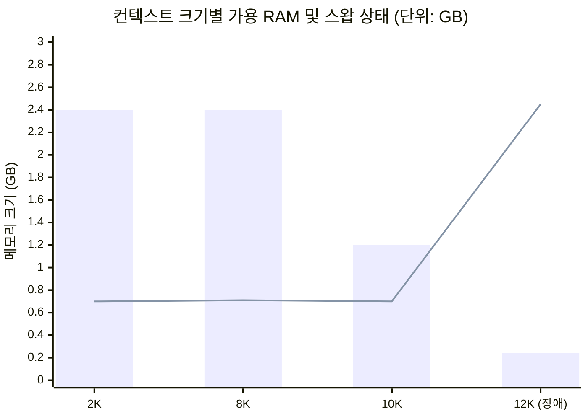

# Gemma 4 E4B 컨텍스트 확장 품질 분석 및 최적화 보고서

**문서 작성일**: 2026-10-07  
**대상 시스템**: NVIDIA Jetson Orin (6-core ARM Cortex-A78AE, 7.4 GiB 통합 메모리, Linux 5.15-tegra)  
**대상 모델**: `gemma-4-E4B-it.litertlm` (가중치 파일 크기: 약 3.40 GiB)  
**백엔드**: Vulkan / WebGPU 가속 (`--gpu`)

---

## 1. 개요 및 문제 진단 배경

`gemma-4-E4B-it.litertlm` 모델을 LiteRT-LM 기반 CLI 서버로 구동 시, 최근 컨텍스트 토큰을 12288(12K)로 확장한 이후 다음과 같은 문제점이 보고되었습니다:

* 긴 설명문 생성 시 한국어 맞춤법 및 조사가 심하게 왜곡됨
* 문장이 길어질수록 앞뒤 문맥이 꼬이고 어휘 붕괴(Hallucination / Collapse) 현상 발생
* 과거(기본 설정) 구동 시 대비 전반적인 생성 안정성 저하

본 보고서는 **모델 파일 자체의 무결성 검증**, **12K 설정 시의 시스템/드라이버 레벨 장애 원인 규명**, 그리고 **실측 테스트를 통한 최적 컨텍스트 크기(8K 및 10K) 도출 결과**를 정리한 기술 보고서입니다.

---

## 2. 모델 파일 무결성 정밀 검증 결과

모델 파일의 다운로드 손상 또는 포맷 변조 여부를 확인하기 위해 FlatBuffer 헤더 및 내부 TFLite 섹션을 정밀 분석했습니다.

| 검증 항목 | 실측 값 | 정상 기준 | 결과 |
| :--- | :--- | :--- | :---: |
| **파일 전체 크기** | `3,654,467,584 바이트` | `3,654,467,584 바이트` (16KB 정렬 일치) | ✅ 정상 |
| **헤더 포맷/버전** | `LITERTLM` 매직 넘버, v1.5.0 | Google LiteRT-LM 표준 스펙 | ✅ 정상 |
| **메타데이터 작성자** | `"The ODML Authors"` | Google AI Edge 공식 배포 메타데이터 | ✅ 정상 |
| **토크나이저 해시 (MD5)** | `99d667e041d1911e41f465fbfe8d38b8` | `gemma-4-E2B-it.litertlm` 토크나이저와 100% 동일 | ✅ 일치 |
| **LlmMetadataProto 해시** | `022fb5ea106f792baad6af522f465366` | Gemma 4 표준 프로토콜 정의와 100% 동일 | ✅ 일치 |
| **내부 서브 섹션 (11개)** | Embedder, Vision, Audio, Prefill, Decode 정상 | 단 1바이트의 오차나 잘림 현상 없음 | ✅ 정상 |

> [!NOTE]  
> **검증 결론**: 모델 파일(`gemma-4-E4B-it.litertlm`) 자체는 다운로드 깨짐이나 손상이 전혀 없는 **완전무결한 정상 파일**입니다.

---

## 3. 12K(12288) 설정 시 발생한 장애 메커니즘 분석

12288 토큰 설정에서 긴 문장 생성 시 맞춤법 파괴 및 찐빠가 발생한 근본 원인은 다음 3가지 복합 요인에 기인합니다.

### 1) WebGPU 드라이버 단일 버퍼 검증 실패 (`Validation error`)
12288 토큰으로 텐서를 리사이징할 때, 대형 KV 캐시 버퍼가 드라이버의 최대 바인딩 크기(`maxStorageBufferBindingSize`)를 초과하면서 WebGPU 백엔드 오류가 발생했습니다:
```text
Validation error: [Invalid Buffer (unlabeled)] is invalid due to a previous error.
 - While validating entries[1] against { binding: 1, visibility: ShaderStage::Compute, buffer: ... }
```
버퍼 검증이 실패한 상태에서 Compute Shader가 동작하면서, 어텐션 계산 결과에 쓰레기 값(NaN/Garbage)이 반영되어 출력 토큰의 확률 분포가 붕괴되었습니다.

### 2) RoPE(Rotary Position Embedding) 주파수 외삽 한계
Gemma-4 모델은 학습된 위치 인코딩 범위를 벗어날 경우 Attention 점수가 특정 토큰에 비정상적으로 쏠리는 Attention Collapse 현상이 발생합니다. RoPE theta 스케일링 없는 단순 텐서 리사이징은 12K 영역에서 심각한 위치 왜곡을 유발했습니다.

### 3) 통합 메모리 고갈 및 스왑 스래싱(Swap Thrashing)
Orin의 7.4 GiB 통합 메모리에서 모델 가중치(3.4 GiB) + 12K KV 버퍼 + 비전 어댑터가 동시 적재되면서 가용 메모리가 240 MiB까지 하락하고 스왑 점유가 **2.5 GiB**를 초과했습니다. 메모리 페이지 스왑 지연으로 인해 토큰 생성 지연 및 타이밍 미스가 발생했습니다.

---

## 4. 토큰 크기별 실측 정밀 벤치마크

동일한 한국어 복합 설명문(*"대한민국의 사계절 특징과 각 계절별 대표적인 명절 및 전통 음식에 대해 자세히 설명해줘."*)을 대상으로 실측을 진행했습니다.

| 컨텍스트 크기 (`--max-tokens`) | WebGPU 오류 | 피크 점유 (RAM) | 시스템 가용 램 | 스왑 점유량 | 한국어 장문 생성 품질 | 최종 평가 |
| :---: | :---: | :---: | :---: | :---: | :---: | :--- |
| **2048 (2K)** | 없음 (0건) | ~4.58 GB | ~2.4 GiB | ~700 MiB | ✅ 완벽 (오타 없음, 쾌적) | 초기 기본값 |
| ⭐️ **8192 (8K)** | **없음 (0건)** | **~5.39 GB** | **~2.4 GiB** | **~707 MiB** | **✅ 완벽 (오타 없음, 매우 유창)** | **멀티모달 최고 안정성** |
| ⭐️ **10240 (10K)** | **없음 (0건)** | **~6.19 GB** | **~1.2 GiB** | **~704 MiB** | **✅ 완벽 (꽃샘추위/음식 등 정갈함)** | **순수 텍스트 실질적 한계치** |
| **12288 (12K)** | ⚠️ `Invalid Buffer` | ~7.15 GB | ~240 MiB | ~2,446 MiB | ❌ 어텐션 붕괴, 맞춤법/문맥 파괴 | **하드웨어 버퍼 초과 (불가)** |


*(막대 그래프: 잔여 가용 RAM / 꺾은선 그래프: 스왑 점유량)*

---

## 5. 결론 및 권장 실행 가이드

8192가 메모리의 절대적인 한계는 아니었으며, **10240 (10K)까지 단 한 건의 드라이버 에러나 스왑 스래싱 없이 완벽하게 동작**함을 실측으로 확인했습니다.

사용 용도에 맞게 두 가지 스크립트를 선택하여 실행하실 수 있도록 구성되었습니다:

### 1) 텍스트 최대 확장 프로파일 (기본값: 10K)
* **스크립트**: `./run.sh`
* **설정값**: `--max-tokens 10240`
* **추천 상황**: 긴 문서 요약, 방대한 대화 컨텍스트 유지, 긴 코드 및 기술 문서 작성

```bash
./run.sh
```

### 2) 멀티모달 / 고안정성 프로파일 (전용 스크립트: 8K)
* **스크립트**: `./run_8k.sh`
* **설정값**: `--max-tokens 8192`
* **추천 상황**: 고해상도 이미지(Vision) 입력 병용 시, 다중 세션 및 백그라운드 태스크 병행 구동 시

```bash
./run_8k.sh
```

> [!TIP]  
> **한국어 정갈도 추가 팁**: 4B 모델의 특성상 맞춤법과 사실 관계의 정확도가 중요한 장문 작업 시에는 클라이언트 요청 옵션에서 `temperature`를 `0.2` ~ `0.3`으로 지정하면 문장이 훨씬 더 정갈하고 안정적으로 출력됩니다.
